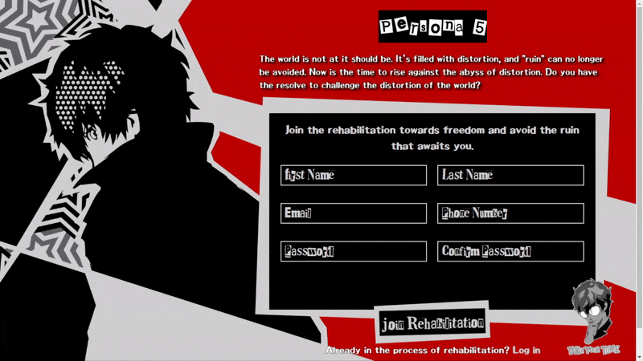
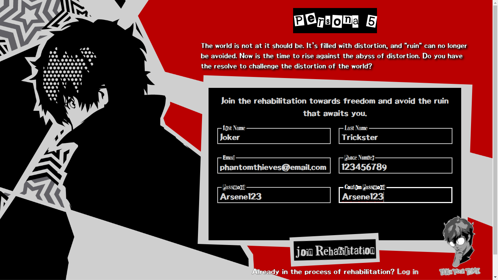
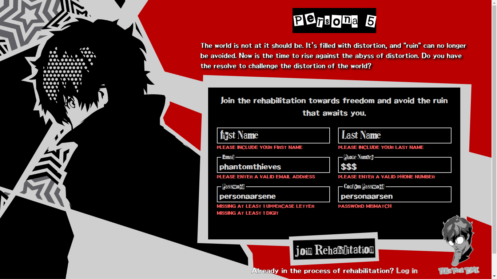

<h1 align="center">Sign-Up Form</h1>
<h3 align="center"><a href="https://gaaabbb.github.io/sign-up-form/">:film_projector: Live Demo</a></h3>

## :scroll: Description
This project, which was created as part of TheOdinProject's Intermediate HTML and CSS Course, is a Sign-Up Form where the assignment is to test and practice my skills and knowledge about forms, different types of input and validating the form. The theme of this project is based on the design of the game "Persona 5".

## :pencil2: Features
* A functional sign-up form that validates the user's inputs.
* Message errors that appears below the input to alert the user.
* Resonsive design that adjusts well with all devices.

## :framed_picture: Gallery
#### Empty Form

#### Form Filled

#### Form Error Messages

## :computer: Languages Used
* HTML
* CSS
* JavaScript

## :copyright: Credits
### Note
*I don't own any of the the pictures, fonts and sentences used in this website. The rights for the materials I used belong to the respective authors, aritsts, and game publishers.*